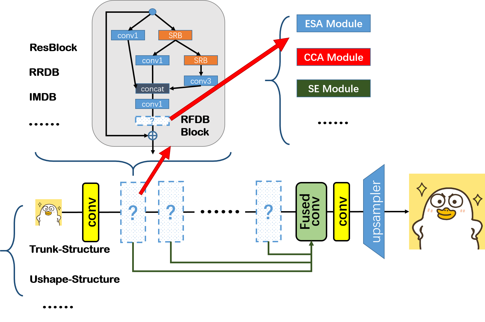

# SR (super-resolution) Archs Constructor

A toolbox for building super-resolution architectures easily

## Introduction

Build the SR architecture with common structures and blocks as LEGO



For example, to build a trunk structured model with RFDB block, using ESA as attention:

```python
from sr_construct.structures import Trunk_Struct
from sr_construct.components.multibranch import RFDB_Module
from sr_construct.components.attention import ESA_Module

in_nc = 3
out_nc = 3
nf = 16
nb = 4
scale = 4
# block parameters
nf_distill = 4
stage = 4
act_type = 'lrelu'

model_arch = Trunk_Struct(in_nc, out_nc, struct_nf=nf, struct_nb=nb, scale=scale, 
                    block=RFDB_Module, n_feat=nf, nf_distill=nf_distill, stage=stage,
                    act_type=act_type, attn_module=ESA_Module)

print(model_arch)
```


## Current Collected Modules

#### components

 (various modules and basic blocks commonly used in SR tasks)

| TYPE         | MODULE NAME    | INFO                             | STATUS | FIGURE |
| ------------ | -------------- | -------------------------------- | ------ | ------ |
| attention    | SE-Module      | Squeeze and Excitation           | done   |        |
|              | CCA-Module     | Contrast-aware Channel Attention | done   |        |
|              | PA-Module      | Pixel Attention                  | done   |        |
|              | PAConv-Module  | Pixel Attention with Conv        | done   |        |
|              | SCPA-Module    | Self-Calibrated Pixel Attention  | done   |        |
|              | ESA-Module     | Enhanced Spatial Attention       | done   |        |
|              |                |                                  |        |        |
| basic blocks | ResBlock       |                                  | done   |        |
|              | DenseBlock     |                                  | done   |        |
|              | PixelShuffle   |                                  | done   |        |
|              | DeconvUp       |                                  | done   |        |
|              | InterpUp       |                                  | done   |        |
|              | PoolDown       |                                  | done   |        |
|              | PixelUnshuffle |                                  | done   |        |
|              |                |                                  |        |        |
| multi-branch | IMDB-Module    | Information Multi-Distillation   | done   |        |
|              | RFDB-Module    | Residual Feature Distillation    | done   |        |
|              |                |                                  |        |        |


#### Structures

| STRUCTURE NAME | INFO                                   | FIGURE |
| -------------- | -------------------------------------- | ------ |
| trunk-net      | common used in SR, e.g. IMDN/RFDN/ELAN |        |
| groups-net     | e.g. RCAN                              |        |
| Ushape-net     | e.g. Unet                              |        |


## **Installation and Setups**


## **Demo**


## **References**

